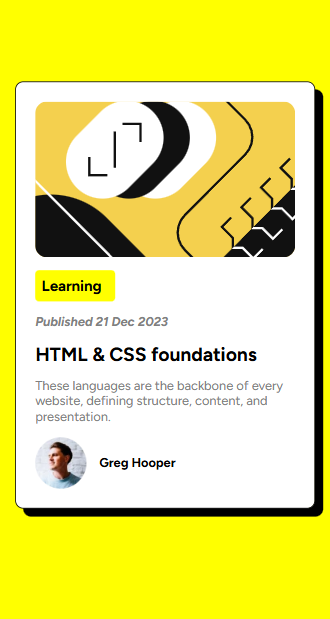

# Frontend Mentor - QR code component solution

This is a solution to the [Blog preview card challenge on Frontend Mentor](https://www.frontendmentor.io/challenges/blog-preview-card-ckPaj01IcS). Frontend Mentor challenges help you improve your coding skills by building realistic projects. 

## Table of contents

- [Overview](#overview)
  - [Screenshot](#screenshot)
  - [Links](#links)
- [My process](#my-process)
  - [Built with](#built-with)
  - [What I learned](#what-i-learned)
  - [Useful resources](#useful-resources)

### Screenshot
### desktop

### mobile

### Links

- Solution URL: https://github.com/27LeandroGimenez/Blog_Preview_Card.github.io
- Live Site URL: [Add live site URL here](https://your-live-site-url.com)

### Built with

- Semantic HTML5 markup
- CSS custom properties
- Flexbox

### What I learned

- HTML
- CSS - Flexbox

### Useful resources
- Sometime claude.ia
- MDN firefox
